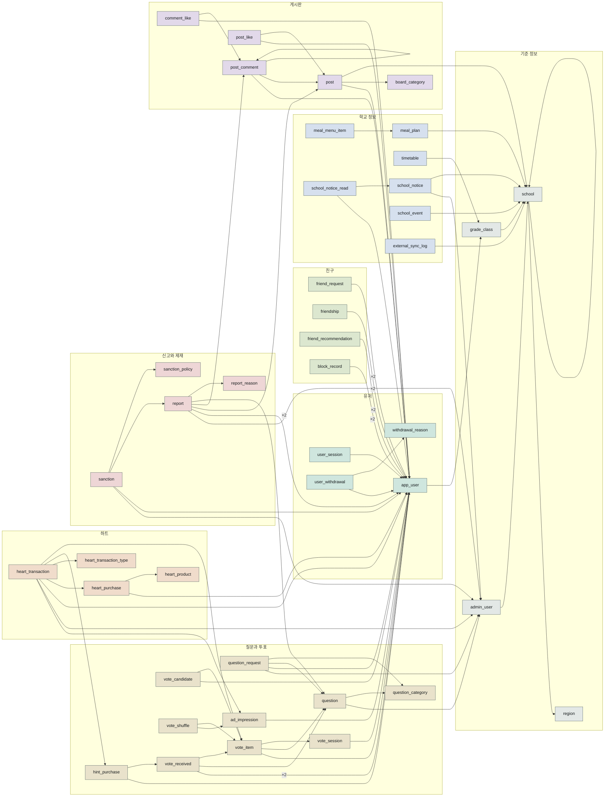
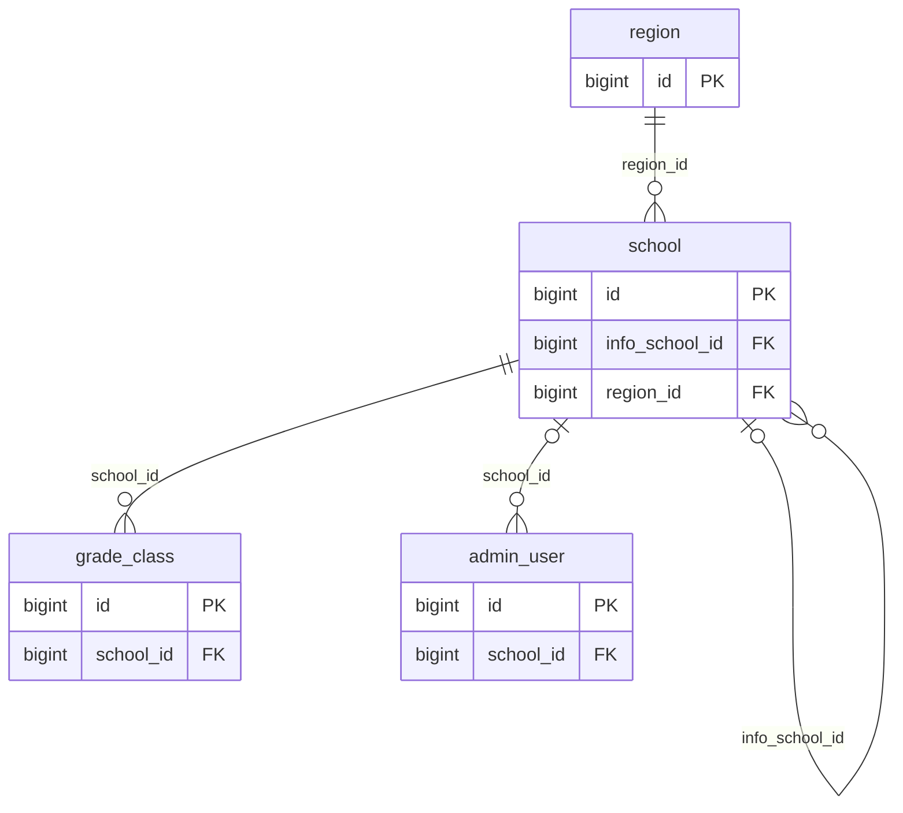
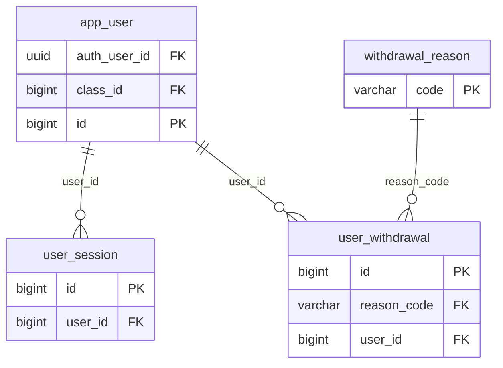
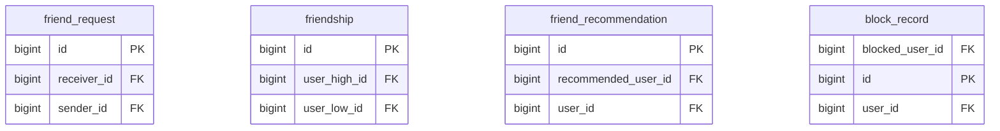
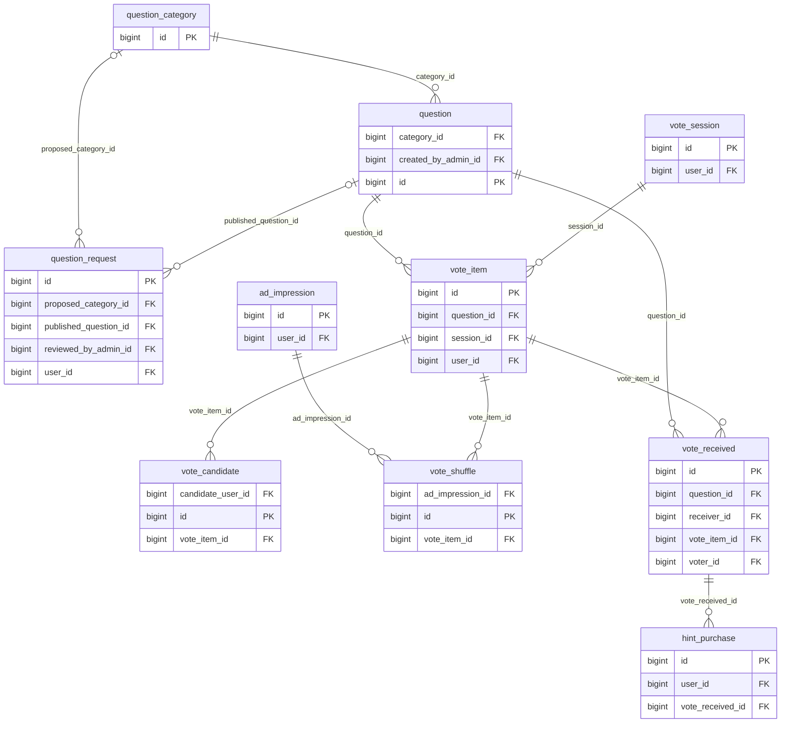
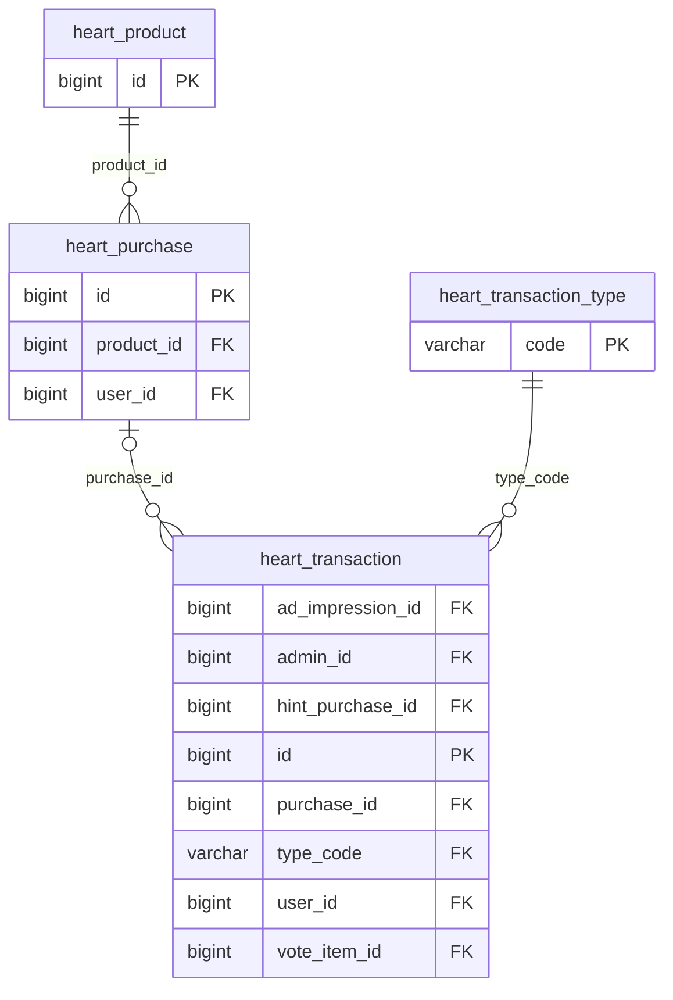
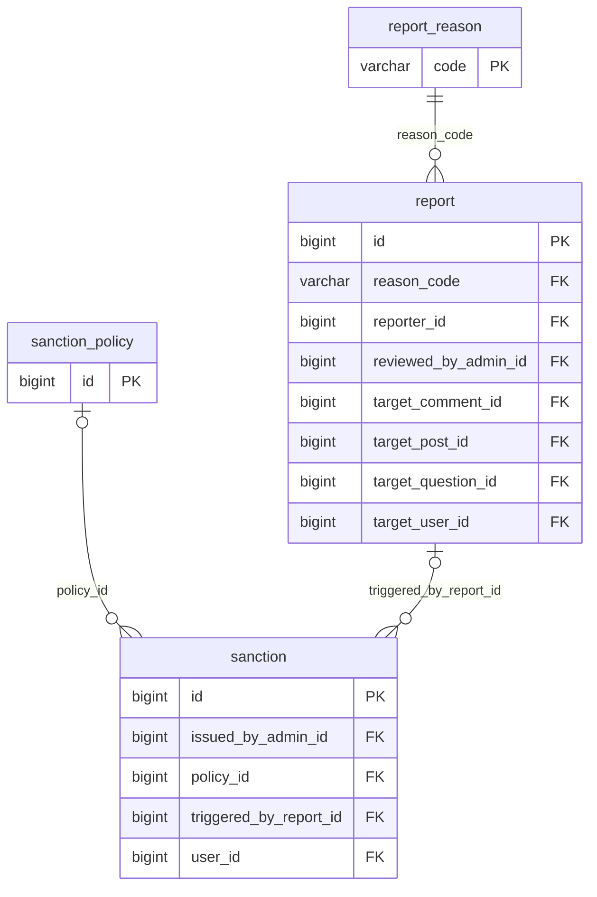
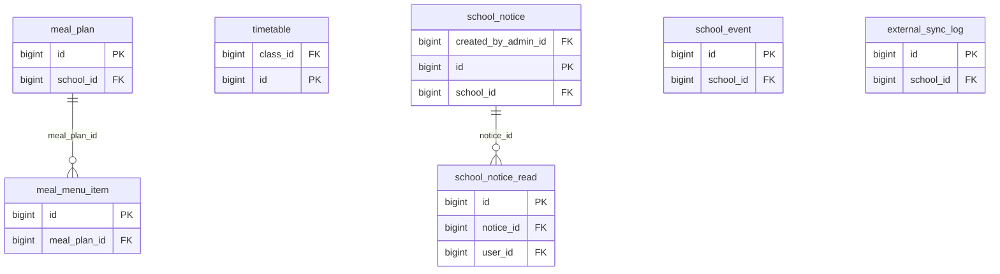
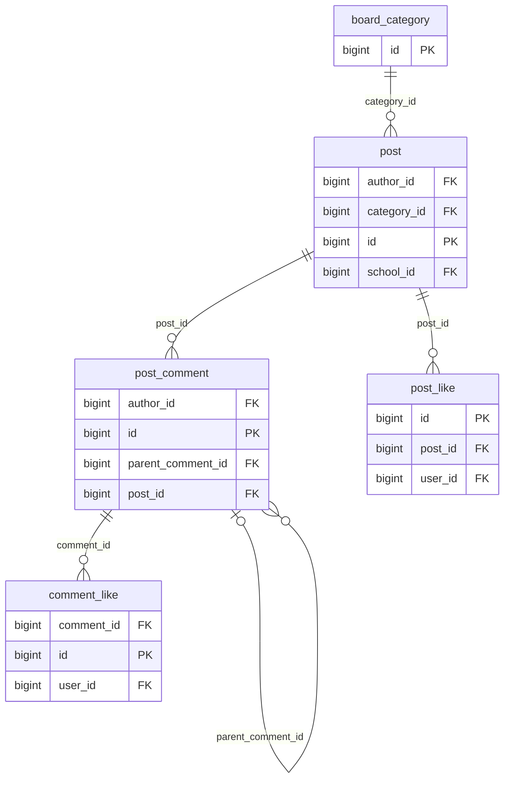

# ERD

> ⚠️ **이 파일은 생성물이다. 손으로 고치지 마라.**
> 살아 있는 스키마에서 뽑는다 — `python db/erd.py`
>
> 관계는 실제로 걸려 있는 FK 만 나온다. 컬럼은 **키(PK·FK)만** 싣는다.
> 전체 컬럼 정의는 `db/ddl/` 이 진실이다.

테이블 **42개** · FK **77개**

점선(`|o`)으로 시작하는 관계는 FK 가 NULL 을 허용한다는 뜻이다.

## 전체

42개를 한 장에 놓은 것이다. 색이 도메인이고, 화살표는 자식 → 부모다.
같은 두 테이블 사이에 FK 가 여럿이면 선 하나로 접고 `×N` 을 붙였다.

## 기준 정보

지역·학교·학급. 유저를 배치할 곳이 먼저 있어야 한다.

## 유저

익명 계정 하나에 프로필 하나. 접속 기록과 탈퇴가 딸린다.

## 친구

요청(방향 있음) → 수락 → friendship(방향 없음).

## 질문과 투표

세션 하나에 아이템 여럿, 아이템 하나에 후보 넷.

## 하트

모든 증감이 heart_transaction 하나를 거친다. 이 프로젝트의 핵심.

## 신고와 제재

신고와 제재를 FK 로 연결한다. 구 시스템에는 이 연결이 없었다.

## 학교 정보

NEIS 에서 받아 채운다. 급식은 데이터를 준 학교 아래 저장한다.

## 게시판

자유게시판(W9). 익명이 아니라 글쓴이가 드러난다.

## 도메인을 넘는 연결

도표를 읽을 수 있게 위 그림에서는 뺐다. 실제로는 걸려 있는 FK 다.

| 자식 | 컬럼 | 부모 |
|---|---|---|
| comment_like (게시판) | `user_id` | app_user (유저) |
| post (게시판) | `author_id` | app_user (유저) |
| post (게시판) | `school_id` | school (기준 정보) |
| post_comment (게시판) | `author_id` | app_user (유저) |
| post_like (게시판) | `user_id` | app_user (유저) |
| report (신고와 제재) | `reporter_id` | app_user (유저) |
| report (신고와 제재) | `reviewed_by_admin_id` | admin_user (기준 정보) |
| report (신고와 제재) | `target_comment_id` | post_comment (게시판) |
| report (신고와 제재) | `target_post_id` | post (게시판) |
| report (신고와 제재) | `target_question_id` | question (질문과 투표) |
| report (신고와 제재) | `target_user_id` | app_user (유저) |
| sanction (신고와 제재) | `issued_by_admin_id` | admin_user (기준 정보) |
| sanction (신고와 제재) | `user_id` | app_user (유저) |
| app_user (유저) | `auth_user_id` | auth.users (스키마 밖) |
| app_user (유저) | `class_id` | grade_class (기준 정보) |
| ad_impression (질문과 투표) | `user_id` | app_user (유저) |
| hint_purchase (질문과 투표) | `user_id` | app_user (유저) |
| question (질문과 투표) | `created_by_admin_id` | admin_user (기준 정보) |
| question_request (질문과 투표) | `reviewed_by_admin_id` | admin_user (기준 정보) |
| question_request (질문과 투표) | `user_id` | app_user (유저) |
| vote_candidate (질문과 투표) | `candidate_user_id` | app_user (유저) |
| vote_item (질문과 투표) | `user_id` | app_user (유저) |
| vote_received (질문과 투표) | `receiver_id` | app_user (유저) |
| vote_received (질문과 투표) | `voter_id` | app_user (유저) |
| vote_session (질문과 투표) | `user_id` | app_user (유저) |
| block_record (친구) | `blocked_user_id` | app_user (유저) |
| block_record (친구) | `user_id` | app_user (유저) |
| friend_recommendation (친구) | `recommended_user_id` | app_user (유저) |
| friend_recommendation (친구) | `user_id` | app_user (유저) |
| friend_request (친구) | `receiver_id` | app_user (유저) |
| friend_request (친구) | `sender_id` | app_user (유저) |
| friendship (친구) | `user_high_id` | app_user (유저) |
| friendship (친구) | `user_low_id` | app_user (유저) |
| heart_purchase (하트) | `user_id` | app_user (유저) |
| heart_transaction (하트) | `ad_impression_id` | ad_impression (질문과 투표) |
| heart_transaction (하트) | `admin_id` | admin_user (기준 정보) |
| heart_transaction (하트) | `hint_purchase_id` | hint_purchase (질문과 투표) |
| heart_transaction (하트) | `user_id` | app_user (유저) |
| heart_transaction (하트) | `vote_item_id` | vote_item (질문과 투표) |
| external_sync_log (학교 정보) | `school_id` | school (기준 정보) |
| meal_plan (학교 정보) | `school_id` | school (기준 정보) |
| school_event (학교 정보) | `school_id` | school (기준 정보) |
| school_notice (학교 정보) | `created_by_admin_id` | admin_user (기준 정보) |
| school_notice (학교 정보) | `school_id` | school (기준 정보) |
| school_notice_read (학교 정보) | `user_id` | app_user (유저) |
| timetable (학교 정보) | `class_id` | grade_class (기준 정보) |
